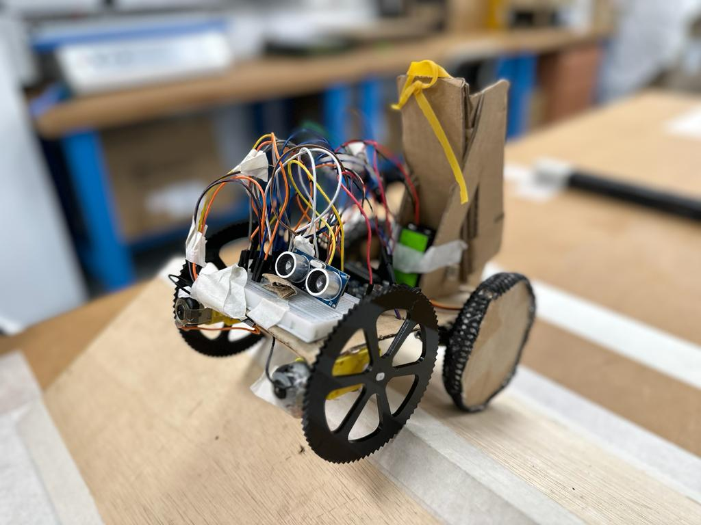

# EG1311-Design-and-Make

Build a robot using DIY materials to overcome obstacles

### Task Definition:

The aim of the project was to design a robot that could successfully traverse an obstacle course consisting of a
bump and a ramp, whilst also being capable of releasing a ball over a 30cm wall from minimally 5cm away.
